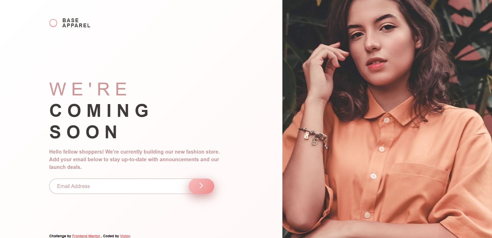

# Frontend Mentor - Base Apparel coming soon page solution

This is a solution to the [Base Apparel coming soon page challenge on Frontend Mentor](https://www.frontendmentor.io/challenges/base-apparel-coming-soon-page-5d46b47f8db8a7063f9331a0). Frontend Mentor challenges help you improve your coding skills by building realistic projects. 

## Table of contents

  - [Overview](#overview)
  - [The challenge](#the-challenge)
  - [Screenshot](#screenshot)
  - [Links](#links)
  - [My process](#my-process)
  - [Built with](#built-with)
  - [What I learned](#what-i-learned)
  - [Continued development](#continued-development)
  - [Useful resources](#useful-resources)
  - [Author](#author)
  - [Acknowledgments](#acknowledgments)

## Overview

### The challenge

Users should be able to:

- View the optimal layout for the site depending on their device's screen size
- See hover states for all interactive elements on the page
- Receive an error message when the `form` is submitted if:
  - The `input` field is empty
  - The email address is not formatted correctly

### Screenshot



### Links

- Solution URL: [https://github.com/victor247k/BaseApparel]
- Live Site URL: [https://victor247k.github.io/BaseApparel/]

## My process

### Built with

- Semantic HTML5 markup
- CSS custom properties
- Flexbox
- CSS Grid
- Mobile-first workflow
- JS

### What I learned

I learned how to proprely use a Mobile-first workflow, I practiced some things i learned in a tutorila, got better at styling, how to use the layout tool in chrome, it helped me align things and also practiced making responsive design. Also prcaticed grid, I didn't use it this way before, it's really useful. And i practiced styling the input lement more.


```html
<input id="email" type="text" placeholder="Email Address" />
```
```css
body {
    display: grid;
    grid-template-columns: minmax(5rem, 10%) minmax(10rem, 40%) minmax(
        5rem,
        10%
      ) minmax(15rem, 50%);
    grid-template-rows: minmax(5rem, 25%) minmax(10rem, 50%) minmax(5rem, 25%);
    grid-auto-flow: dense;
}
  #email {
  flex-grow: 1;
  border: 1px solid;
  border-color: var(--clr-desaturated-accent);
  border-radius: 1.5rem 0 0 1.5rem;
  padding-left: 1.5em;
  font-size: 1rem;
  color: var(--clr-dark);
}
#email::placeholder {
  color: var(--clr-desaturated-accent);
}
```

### Continued development

I will definetly need more practice with responsive design, layouts in general, and with display grid, I don't know if I did the image corectly so I have to get better at doing that.

### Useful resources

- [Example resource 1](https://youtu.be/QBfblbmTTF4) - This helped me with the layout. I really like how this person explains stuff and I will definetly watch him again in the near future.
- [Example resource 2](https://css-tricks.com/gradient-borders-in-css/) - Do you know how to do a gradient background? I didn't until I came across this amazing tutorial.

-[Example resource 3](https://www.cssmatic.com/box-shadow) - Most useful site for understanding the box-shadow atribute(or what it is) it is very useful.

## Author

- Discord - Victor247#1836
- Frontend Mentor - [@victor247k](https://www.frontendmentor.io/profile/victor247k)
- Instagram - [@victorspinei247](https://www.instagram.com/victorspinei247/)

## Acknowledgments

I am thankful for this amazing challenge from FrontEnd Mentor,I really liked it, it allowed me to practiced the things i learned from a tutorial and to get better at making a responsive website, I will use this knowledge to build my own website one day, maybe this summer. Also I am grateful for Kevin Powell for hsi amazing tutorials, that is where I got the motivation to sit and finsih this from start to finish, it took in total like 6 hours with pauses in between to do his tutorial and this challenge. And I am grateful for all the suport I get and all of the sources that helped me.